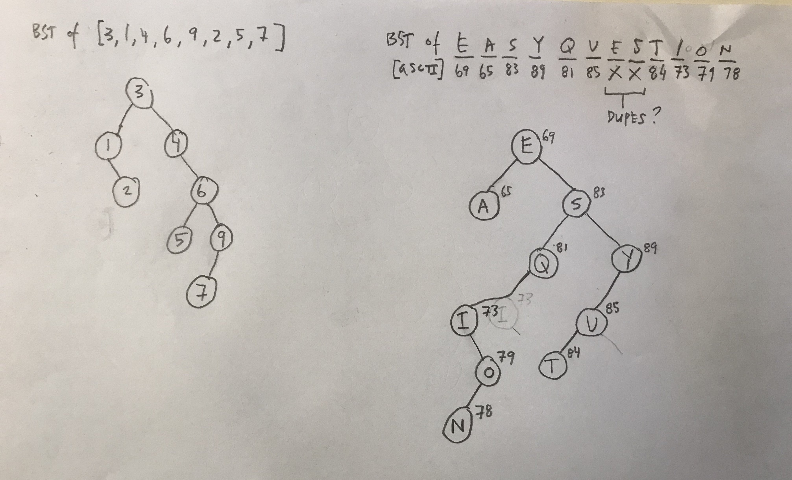
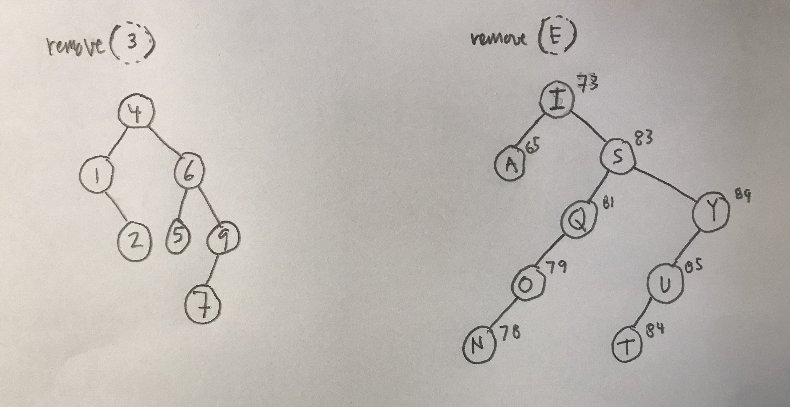

# Working with binary search trees

**[Thinkful Data Structures & Algorithms assignment](https://courses.thinkful.com/dsa-v1/checkpoint/8#assignment)**

To run any of these scripts, in terminal command line enter: `node script-name.js`

<br />

## 1. Draw a Binary Search Tree (BST)

**1 ]** Given the data `3,1,4,6,9,2,5,7`, if you were to insert this into an empty binary search tree, what would the tree look like? (Draw the tree, no coding needed here.)
```
            [3]                              
           /   \                
        [1]     [4]                 
           \       \                   
            [2]     [6]   
                   /   \                
                [5]     [9]
                       /              
                    [7]
```

**2 ]** Draw the BST with the keys - E A S Y Q U E S T I O N

> Presumably would convert the string characters to numerical ASCII 
> (Question: should I then create hash value with the hash function `k Mod m`, too?)



## 2. Remove the root

Show how the above trees would look like if you deleted the root of each tree. (Draw the trees, no coding needed here.)




## 3. Create a BST class

see: **[`BST-class.js`](https://github.com/artificialarea/DSA-BST/blob/main/BST-class.js)** + **[`create-bst.js`](https://github.com/artificialarea/DSA-BST/blob/main/create-bst.js)**

> Can't determine if successful, as `console.log` output truncated (see below). 

> Tried to `JSON.stringify()`, but got the error: `TypeError: Converting circular structure to JSON`

> Tried to implement the service object helpers `getRootNode()` and `inorder()` -- per: https://www.geeksforgeeks.org/implementation-binary-search-tree-javascript/ -- to print output, but failed: `RangeError: Maximum call stack size exceeded`


```
BinarySearchTree {
  key: 3,
  value: undefined,
  parent: null,
  left: BinarySearchTree {
    key: 1,
    value: null,
    parent: [Circular],
    left: null,
    right: BinarySearchTree {
      key: 2,
      value: null,
      parent: [Circular],
      left: null,
      right: null
    }
  },
  right: BinarySearchTree {
    key: 4,
    value: null,
    parent: [Circular],
    left: null,
    right: BinarySearchTree {
      key: 6,
      value: null,
      parent: [Circular],
      left: [BinarySearchTree],
      right: [BinarySearchTree]
    }
  }
}
```

```
BinarySearchTree {
  key: 'E',
  value: undefined,
  parent: null,
  left: BinarySearchTree {
    key: 'A',
    value: null,
    parent: [Circular],
    left: null,
    right: null
  },
  right: BinarySearchTree {
    key: 'S',
    value: null,
    parent: [Circular],
    left: BinarySearchTree {
      key: 'Q',
      value: null,
      parent: [Circular],
      left: [BinarySearchTree],
      right: null
    },
    right: BinarySearchTree {
      key: 'Y',
      value: null,
      parent: [Circular],
      left: [BinarySearchTree],
      right: null
    }
  }
}
```