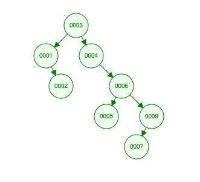
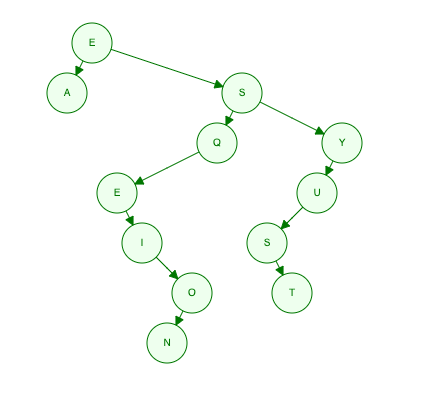
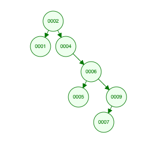
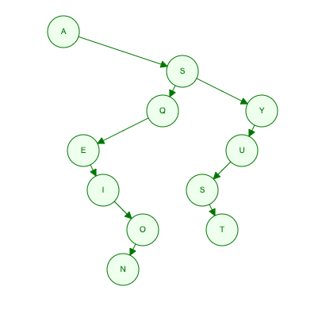

# Working with binary search trees

**[Thinkful Data Structures & Algorithms assignment](https://courses.thinkful.com/dsa-v1/checkpoint/8#assignment)**

To run any of these scripts, in terminal command line enter: `node script-name.js`


<br />

## 1. Draw a Binary Search Tree (BST)

Binary Tree Images generated via https://www.cs.usfca.edu/~galles/visualization/BST.html

**1 ]** Given the data `3,1,4,6,9,2,5,7`, if you were to insert this into an empty binary search tree, what would the tree look like? (Draw the tree, no coding needed here.)



<br />

**2 ]** Draw the BST with the keys - E A S Y Q U E S T I O N

> First convert the characters in the string to ASCII numbers, then...




<br />

## 2. Remove the root

Show how the above trees would look like if you deleted the root of each tree. (Draw the trees, no coding needed here.)

> The diagram generator opted for **Order Predecessor** instead of **Order Successor** method.
> * **Order Predecessor**: replace vacated parent node with the largest value from the left child node. 
> * **Order Successor**: replace vacated parent node with the smallest value from the right child node.






<br />

## 3. Create a BST class

see: **[`BST-class.js`](https://github.com/artificialarea/DSA-BST/blob/main/BST-class.js)** + **[`create-bst.js`](https://github.com/artificialarea/DSA-BST/blob/main/create-bst.js)**

> Was unable to printout full tree in typical ways >_< 

> `console.log(BST);` results in incomplete printout of object, prematurely ending at the 3rd level

> `console.log(JSON.stringify(BST));` results in "TypeError: Converting circular structure to JSON" 

> Thankfully there is a **[`print-bst`](https://www.npmjs.com/package/print-bst)** npm package that enables printout of the full tree and a visual respresentation too!!

```

  __3          
 /   \         
1     4__      
 \       \     
  2       6__  
         /   \ 
        5     9
             / 
            7  


  E__________          
 /           \         
A             S______  
             /       \ 
      ______Q         Y
     /               / 
    E             __U  
     \           /     
      I__       S      
         \       \     
          O       T    
         /             
        N 
               
```

<br />

## 4. What does this program do?

Without running this code in your code editor, explain what the following program does. Show with an example the result of executing this program. What is the runtime of this algorithm?

```
function tree(t){
    if(!t){
        return 0;
    }
    return tree(t.left) + t.value + tree(t.right)
}
```

> This recursive function is the sum value of all the descendants of a parent node.
> Output: **[`what-does-this-do.js`](https://github.com/artificialarea/DSA-BST/blob/main/what-does-this-do.js)** 
> Complexity: **O(2^n) Exponential Time** since each function calls itself recursively twice with each iteration. 


<br />

## 5. Height/Levels of BST

see: **[`height-bst.js`](https://github.com/artificialarea/DSA-BST/blob/main/height-class.js)**

> Done with mentor solution... but I don't understand the recursive logic.


<br />

## 6. Is it a BST?

see: **[`is-it-bst.js`](https://github.com/artificialarea/DSA-BST/blob/main/is-it-bst.js)**

> Done with mentor solution... but I don't understand the recursive logic.


<br />

## 7. 3rd largest node

see: **[`nth-largest-node.js`](https://github.com/artificialarea/DSA-BST/blob/main/nth-largest-node.js)**